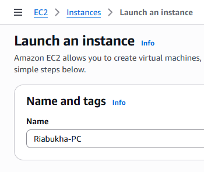
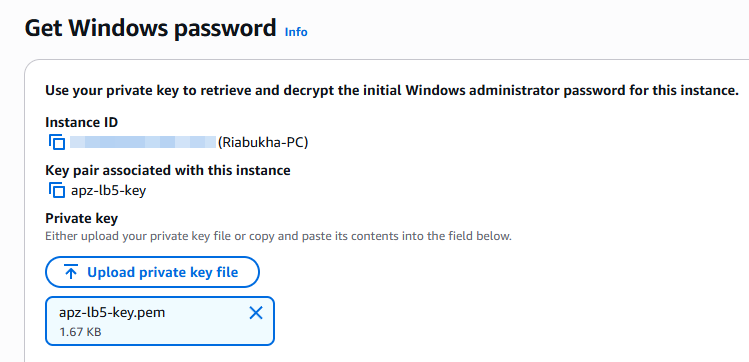
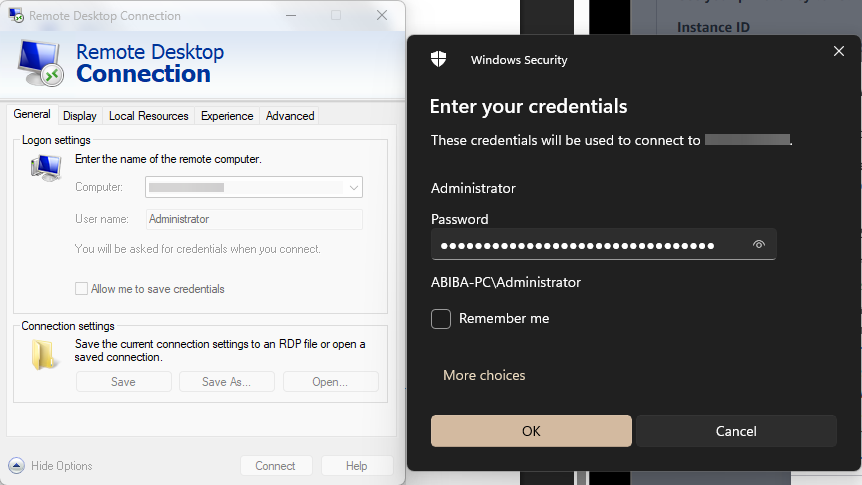
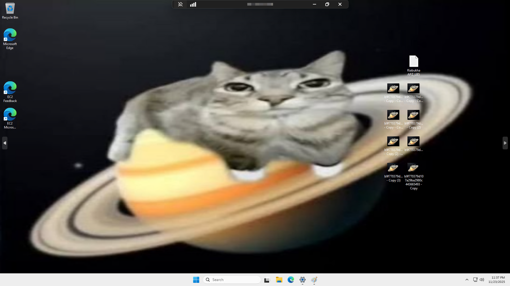

# **Практична робота №5**

**Тема:** AWS EC2.

**Мета роботи:** Набування навичок створення та розміщення віртуального сервера за допомогою AWS EC2.

## **Хід роботи**

### **1.** Створюємо та запускаємо Instance:

Рис. 1.1 Name and tags

Рис. 1.2 Створення key pair

Рис. 1.3 Успішне створення Instance

### **2.** Отримання зашифрованого паролю:

 
Рис. 2 Windows password

### **3.** Підключаємося до створеного ПК:

Рис. 3.1 Введення IP/Username/Password

Рис. 3.2 Відображення робочого столу